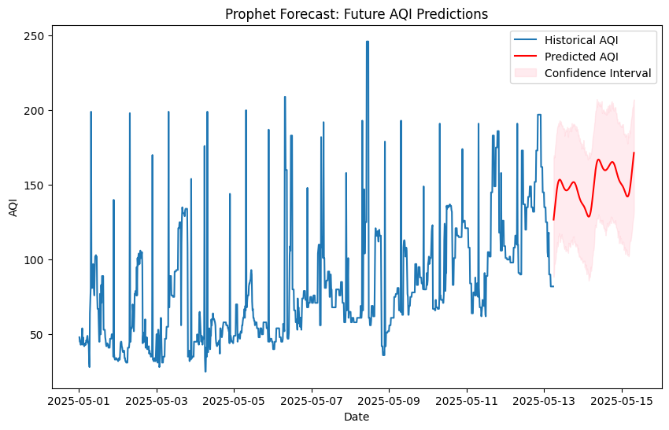

# 🌫️ Air Quality Forecasting with Facebook Prophet

This project forecasts the Air Quality Index (AQI) using historical data from Amravati, India. It uses the Facebook Prophet model for time series forecasting and visualizes actual vs. predicted AQI values.

## 📌 Project Highlights
- Real-time AQI data resampled to 15-minute intervals
- Time series forecasting with Facebook Prophet
- Visualization of predicted vs. actual AQI with training/test split
- Insights into PM2.5 levels vs WHO guidelines

## 📊 Libraries Used
- pandas
- matplotlib
- numpy
- prophet

## 📁 Dataset
- Source: [IQAir - Amravati](https://explore.openaq.org/locations/5408)

## 📈 Sample Output
The model forecasts AQI values and overlays real test data after the training period with a red vertical line to separate training and test.


## 🚀 Run the Project

1. Clone the repo
2. Install dependencies:
   ```bash
   pip install -r requirements.txt
   ```

3. Run the notebook:
   ```bash
   jupyter notebook aqi_pred.ipynb
   ```

## 🧠 Insights
- PM2.5 concentration reached over **4.2 times** the WHO annual safe limit.
- AQI fluctuates frequently in short time windows, highlighting the importance of fine-grained prediction.

## ✅ Future Enhancements
- Compare Prophet with other ML models (e.g. Random Forest, XGBoost, LSTM)
- Build a real-time AQI dashboard using Streamlit or Dash
